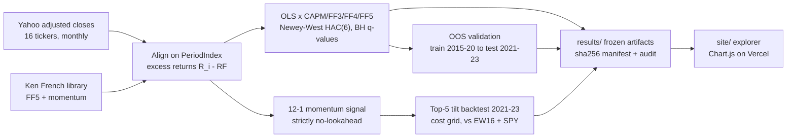

# Multi-Factor Equity Pricing

CAPM and Fama-French 3/4/5-factor analysis of a 16-stock US universe (2015-2023, monthly),
with proper inference (Newey-West HAC), multiple-testing control, out-of-sample validation,
and a cost-aware momentum-tilt backtest. Ships with frozen artifacts, a hash-stamped
manifest, an audit script, a pytest suite, and a live interactive explorer.

**Live explorer:** https://equity-factor-model.vercel.app
**Full write-up:** [REPORT.md](REPORT.md)

## What it does

| Piece | Detail |
|---|---|
| Factor regressions | OLS of monthly **excess** returns on CAPM / FF3 / FF3+UMD / FF5 factors, Newey-West HAC(6) standard errors |
| Multiple testing | Benjamini-Hochberg q-values across the 16 alphas of each model |
| Diagnostics | Jarque-Bera normality, Ljung-Box(12) autocorrelation on residuals; 36-month rolling betas |
| Out-of-sample | Betas fit on 2015-2020, applied once to 2021-2023; OOS R² vs train-mean benchmark |
| Backtest | Top-5 of 16 by 12-1 momentum, monthly rebalance, 2021-2023 (strictly OOS), cost grid 0/10/25/50 bps per unit turnover, vs equal-weight universe and SPY |
| Reproducibility | One scripted run (`experiments/run_analysis.py`), frozen `results/`, sha256 manifest + `experiments/audit_snapshot.py`, 14 pytest tests |

## Quickstart

```bash
python -m venv .venv && source .venv/bin/activate
pip install -r requirements.txt
python experiments/run_analysis.py     # regenerates results/ and site/data/
python experiments/audit_snapshot.py   # verifies frozen artifact hashes
pytest tests -q
python -m http.server -d site 8000     # explore the site locally
```

## Headline results (frozen run, 2015-2023)

- AAPL FF3: beta_MKT **1.29**, R² **0.56**; alpha +0.85%/mo, BH q=0.20 - **not** statistically distinguishable from zero.
- Factor structure generalizes out of sample: mean OOS R² 0.35 (CAPM) -> **0.50 (FF3)** -> 0.52 (FF5).
- Momentum tilt 2021-2023: +74% gross / +71% net of 10 bps vs SPY +33% - but **lower Sharpe than the equal-weight universe** (0.78 vs 0.90). No free lunch, reported as-is.
- Under plain OLS, META's momentum loading looks significant (p=0.008); under Newey-West it does not (p=0.08). Inference method changes conclusions.


## Architecture



Full module map and the backtest no-lookahead loop: [docs/architecture.md](docs/architecture.md)

## Layout

```
src/factor_model/     data.py regression.py diagnostics.py backtest.py
experiments/          protocol.yaml run_analysis.py audit_snapshot.py
results/              frozen CSV/JSON artifacts + manifest.json + provenance.json
tests/                pytest suite (14 tests)
site/                 static explorer (Chart.js), deployed on Vercel
```

Research artifact, not investment advice.
