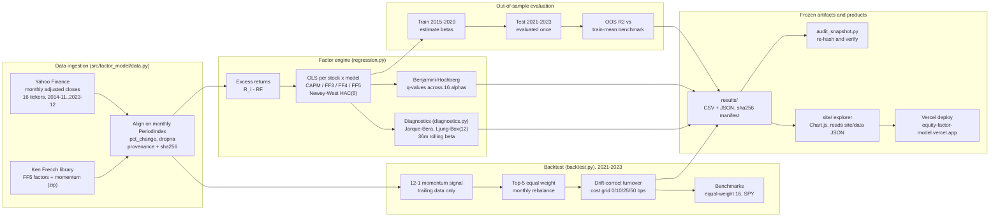
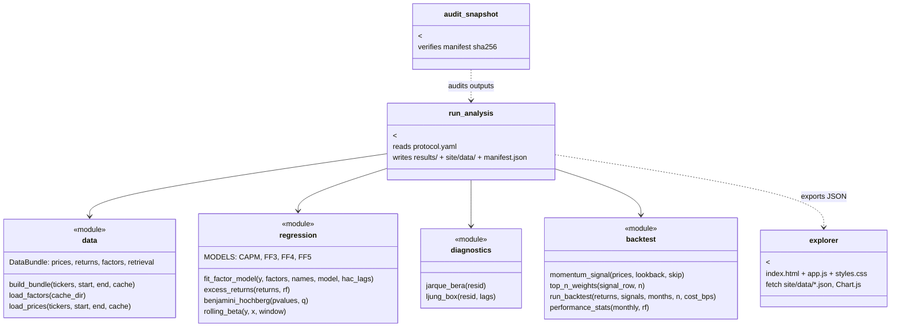
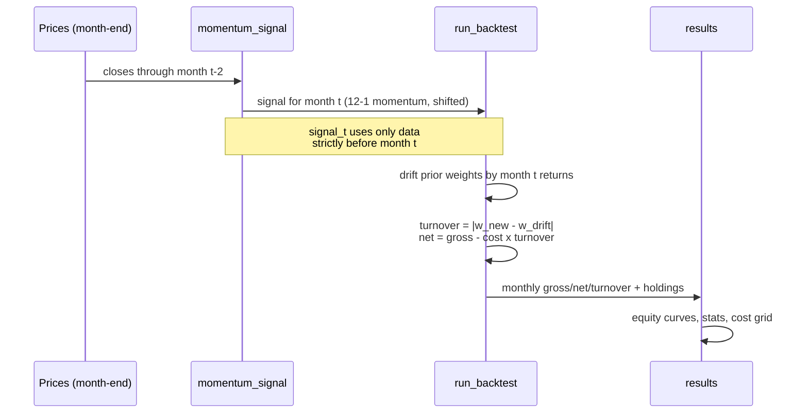

# Architecture

Two views of the same system: the end-to-end analysis pipeline, and the module map.
Both describe the code as it exists in this repository - no aspirational boxes.

## End-to-end pipeline

## Module map

## Backtest loop (no-lookahead invariant)

